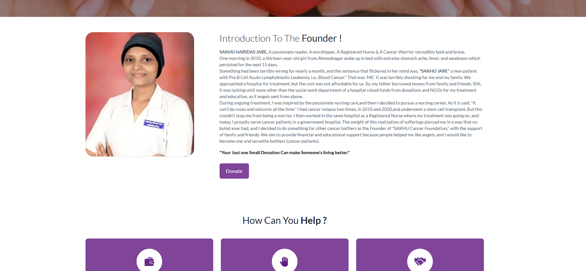
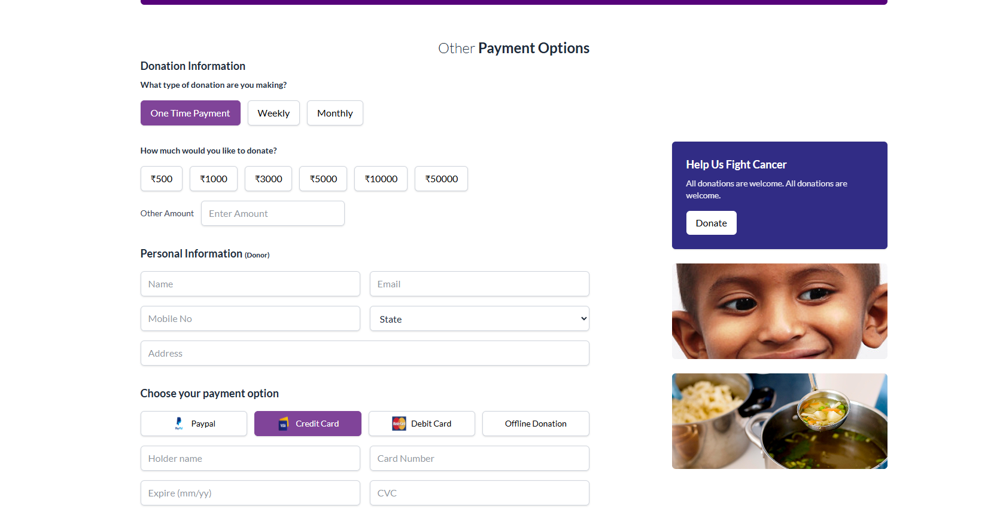
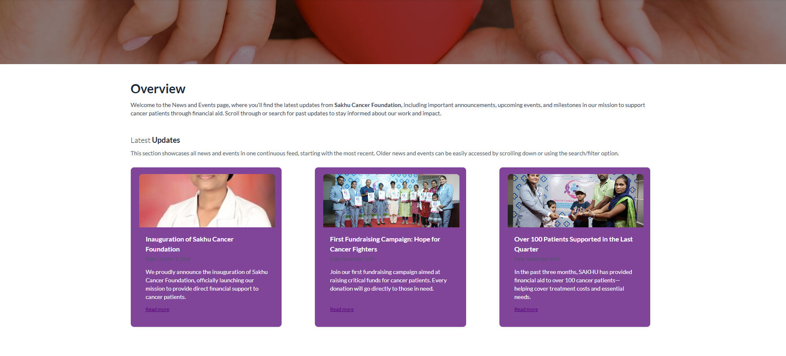
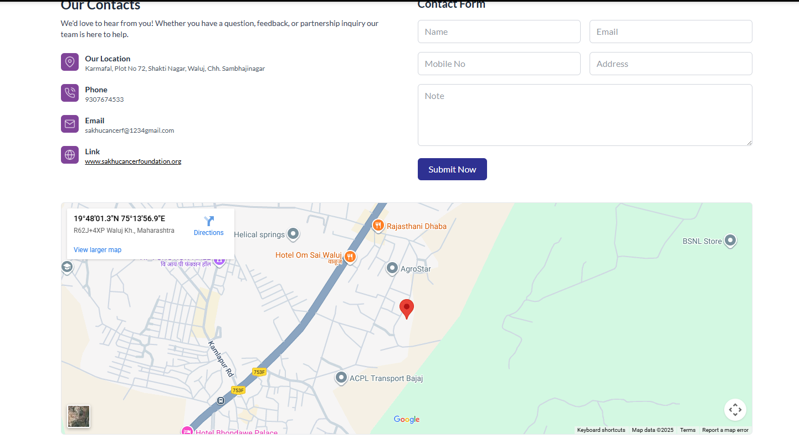

# Sakhu Cancer Foundation — Website (React + Vite)

This repository contains the frontend for the Sakhu Cancer Foundation website built with modern React, Vite, and Tailwind CSS. It showcases clean architecture, component-driven UI, and practical integrations.

Note: This project is prepared for hiring purposes. It highlights skills in React, routing, styling systems, API integrations, and production-ready setup.

**Highlights**
- React 19 with `react-router-dom` for client-side routing.
- Vite 7 for a fast dev/build pipeline.
- Tailwind CSS v4 via PostCSS with a custom theme using `@theme` tokens.
- Modular components and pages with a simple layout composition (`Header` + `Footer`).
- Optional integrations: Admin API, YouTube uploads, Google Maps.

## Tech Stack
- React `^19.1.1`, React DOM `^19.1.1`
- Vite `^7.1.7`, `@vitejs/plugin-react`
- React Router `^6.30.1`
- Tailwind CSS `^4.1.16` with PostCSS and Autoprefixer
- ESLint with React Hooks and Refresh plugins

## Project Structure
```
src/
  components/        # Reusable UI components (Header, Footer, etc.)
  pages/             # Route-based pages (Home, About, Donation, News, etc.)
  lib/               # Client-side integrations (admin API, YouTube helpers)
  assets/            # Images and static assets used by the UI
  index.css          # Tailwind entry + theme tokens + base/utilities
  App.jsx            # Routes and layout composition
  main.jsx           # App bootstrap with BrowserRouter
```

## Implementation Details
- Routing: Defined in `App.jsx` using `Routes` and `Route`. Pages include `Home`, `About`, `Donation`, `Contact`, `Volunteer`, `Resources`, `Gallery`, `Videos`, `News`, `NewsDetail` (dynamic `id`). `main.jsx` wraps the app in `BrowserRouter`.
- Layout: `Header` and `Footer` wrap routed content for consistent navigation and site framing.
- Styling: Tailwind v4 via `@import "tailwindcss";` in `index.css`. A custom theme defines tokens like `--font-sans` and brand colors under `@theme`. Base layer applies typography, background, and utility classes; examples include `.no-scrollbar`.
- Assets: Images under `src/assets/*` power visuals across pages.
- Data & Integrations:
  - Admin API (`src/lib/adminApi.js`): reads `VITE_ADMIN_API_BASE` for CORS-safe endpoints like `/api/news`, `/api/hero`, `/api/gallery/photo`, `/api/gallery/video`. All functions are resilient, returning empty arrays on failure.
  - YouTube (`src/lib/youtube.js`): helpers to fetch channel uploads via the Data API using `VITE_YOUTUBE_API_KEY` and `VITE_YOUTUBE_CHANNEL_ID`. Includes `makeYouTubeThumb` for thumbnails.

## Environment Variables
Create a `.env` file (not committed) based on `.env.example`:
```
VITE_ADMIN_API_BASE=
VITE_GOOGLE_MAPS_API_KEY=
VITE_YOUTUBE_API_KEY=
VITE_YOUTUBE_CHANNEL_ID=
```
- Only variables prefixed with `VITE_` are exposed to the browser.
- Keep secrets out of the frontend; use public or proxy-friendly APIs.

## Scripts
- `npm run dev`: Start Vite dev server.
- `npm run build`: Production build to `dist/`.
- `npm run preview`: Preview the production build locally.
- `npm run lint`: Lint source files.

## How to Run
1. Install dependencies: `npm install`
2. Create `.env` using `.env.example`
3. Start dev server: `npm run dev`
4. Visit `http://localhost:5173` (default Vite dev port)

## Screenshots
Screenshots live under `docs/screenshots/`. Add PNGs with names:
- `home.png`, `about.png`, `donation.png`,  `news.png`, `contact.png`

Capture guide:
1. Run `npm run dev` and open the site.
2. Navigate to each page, capture at approximately `1280x800`.
3. Save as `docs/screenshots/<page>.png`.

Markdown previews:






## Deployment
- Build with `npm run build` to generate static assets in `dist/`.
- Host `dist/` on any static provider (Netlify, Vercel static, GitHub Pages, S3 + CDN).
- Ensure environment variables are provided via build-time or runtime configuration.